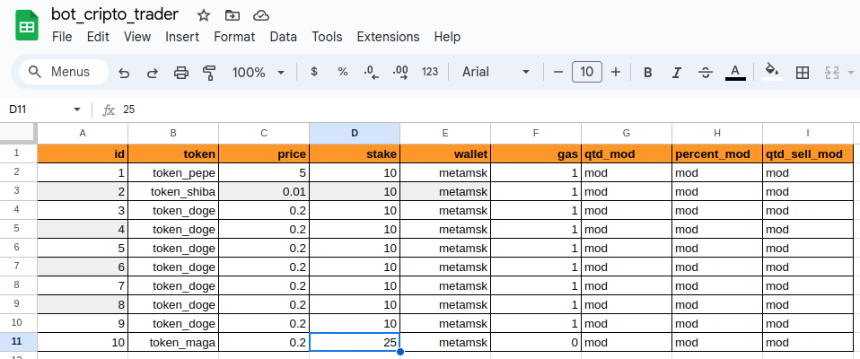

# data-proc-pepper-juice
Description. 
This project make a bot for trader crypto and deploy it at google cloud. 
Flow for Rollout: 
* Deploy this app(local size or google cloud)
* Insert Data in google spreedsheet.
* run it.
## Required: 
* Telegram token(bot).
* Telegram group with bot admin.
* Coinmarket cap api token(free).

## Data Source 

## Telegram BOT Reports.

<strong>Check the code in scr/</strong>

## Deploy Policy
For short, the policy for this poc project not hold tokens in secret at cloud. 
If you need this layer, contact-me. 
### Contact
* mail: rodrigo.root.rj@gmail.com
* Telegram: @rodrigobrasilrj
### Freelancer Chanels
* https://www.freelancer.com/u/rodrigorootrj2
* https://www.workana.com/freelancer/789e330507e519d8119ed20de89ec0f5
